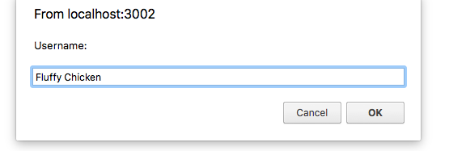
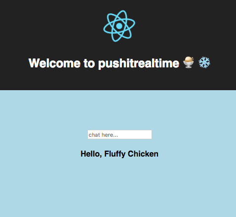
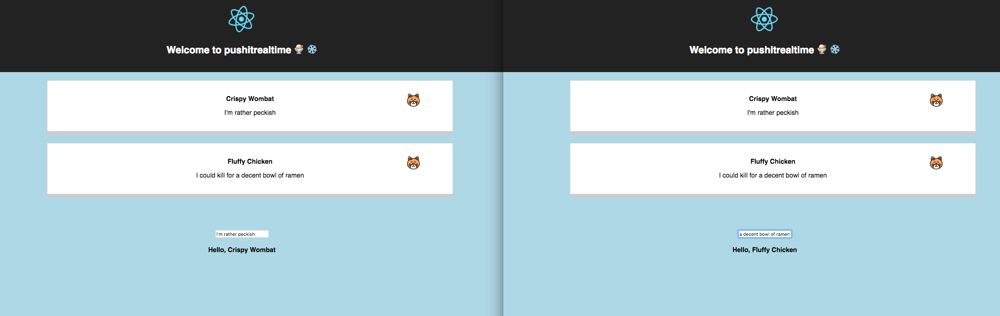

# pushitrealtime

Vanilla Ice did it, and now so can you. This is a playful toying with the Pusher API, which kindly uses websockets to create a **chat room** that updates in _real-time_.

## Technologies

An Express server provides a single post route to the React frontend.
Pusher provides an API for updating the chat room in real time.

## Why?

Pusher have some interesting use cases and I wanted to play with their offering.

## Installation:

First grab the repo:

```
$ git clone path/to/this/repo
```

Change to the directory:

```
$ cd pushitrealtime
```

Then install dependencies:

```
$ npm install
```

Installing `nodemon` globally will be useful, as it listens to your `server.js` file for changes and automatically reboots itself:

```
$ npm install -g nodemon
```

Start the express server, which will default to port 5001:

```
$ nodemon server
```

And start your React app:

```
npm start
```

Load two separate windows, and log in with different `usernames`:


And enter a chat message in the box:


So that you can chat in real-time with your (animal) friends:

